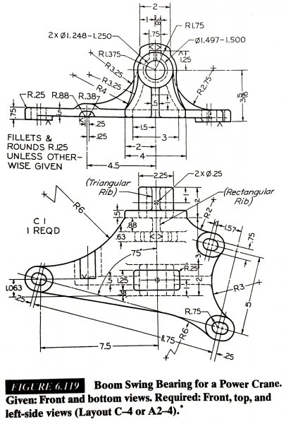

# Ray's Project Portfolio 

Hello! This page serves to show off some of the personal projects I've completed during my time as a student at the University at Buffalo. Thanks for dropping by!

## Gaming Arena Console Enclosure

This is a mock up of a console pod enclosure for my university's gaming arena known as Level Up. This was designed using SolidWorks, and it was designed in response to thermal concerns due to the use of PS5 and Xbox consoles inside of the enclosure. While the exact design was not used, some parts were used in the final design, including the presence of a metal grill and exhaust ports to dissapate heat. I also used MATLAB to fabricate a thermal analysis on the cage itself for practice with MATLAB's modeling tools.

Here is the final design currently in use at the university, where the essence of the cage and parts of the enclosure are present:

## 1 to 1 Lasko Fan Model Replication

With SolidWorks, I decided to model a replica of the Lasko Cyclone fan I had sitting in my room as an assembly drawing. Each part of the fan was modeled as a seperate part, as it came in the box when I bought it; the fan blades, the cage, the stand, the base, and the motor were all modeled with 1:1 scale dimensions taken with real life. The parts were then all combined into an assembly drawing, in the order of actual assembly of the product. The model's blades and stand also move just as they do in real life. 

Here's the real life version:

The model I created was missing a few details such as the embossing on the stand, some flares on the shaft as well as the rim of the fan cage. Overall, it was really great practice modeling unusual and unsymmetric shapes in the software.

## Steam Turbine Ideal Rankine Cycle Simulator

Using MATLAB, I developed a small program to simulate the ideal rankine cycle in a steam turbine, a concept reviewed in a Thermodynamics course I took previously as an assistant to help me with a course final project. This program took input for multiple variables such as inlet pressure, temperature, pump speed, efficiency, flow rate. The resulting output gave quantites such as the quality of the steam, the overall thermal efficiency, and even power generated during the cycle. This allows one to see the impact of changing variables such as pressure and temperature in a quick and efficient manner.

For steam table calculations, I used a MATLAB function created by UB SEAS faculty given to students, which automatically calculating all enthalpys and entropies needed. 

Here's a quick demo of the simulator:

For this demo, I purposely used values that would return extreme properties to show the flexibility of the program using essentially any value. While the outputs may not be realistic, it makes the impact of changing things such as temperature and pressure on the cycle much easier to see.

## Thin Plate Finite Method Analysis (FMA)

As a challenge from my Structures of Analysis course textbook, I decided to do an FMA on a theoretical steel thin plate as given as a challenge question. 

Here is the mesh provided:

After conducting a FMA with an applied force of P at the top of the steel plate, this is the result:

Pretty cool, right?

## Boom Swing Bearing 2-D Technical Drawing

This is a drafting exercise taken from the Technical Drawing with Engineering Graphics textbook, a book out of Embry Riddle and Montana State University used to teach advance drafting techniques that is more applicable to industry, versus the introductory drafting courses taught by many universities. While I was not a university student when I attempted this exercise, this is still more advanced than any drawing I have completed as a student to this day and probably will be more advanced than anything requried in an ABET cirriculum.

Here's my rendition of this exercise:

This draft was entered into SUNY Niagara Community College's Tech Wars, an engineering centered competition, specifically in their technical drafting category and went on to win 1st place in the category.

# Volunteering and other projects

## University at Buffalo IT Communication and Engagement

As part of my leadership position at UBIT that comes with my employment, on occasion I collaborate with the university's IT Communication and Engagement social media team as a student representative to promote good IT habits at the university from a student's perspective.

Here's a video that I did with current Information Technology VPCIO Brice Bible (also a former engineer!!) during Fall 2023 move-in day at our South Campus:
<video controls>
  <source src="https://github.com/rayalhar/rayalhar.github.io/raw/main/assets/img/UBIT360.mp4" type="video/mp4">
</video>

I am also currently working another video with the IT Communcations and Engagement team as of 3/2024.

## University at Buffalo Nanosatellite Laboratory: GLADOS (Glint Analyzing Data Observation Satellite) 

GLADOS is a 6U CubeSat out of the UB Nanosat Laboratory that is slated for a 2025 launch, selected by NASA and the AirForce for their small satellite program. I am part of the Operations team in which we deal with preparing for the satellite's daily communication and operation once it is launched. This subsystem requires enhanced knowledge about every part of the satellite, which means I have to juggle knowledge about the Thermal, Structures, Guidance and Navigation, etc. I am also in charge of the Mission Control room present in the lab, where I deal with everything hardware and software present in the space.

<!-- Repeat the pattern for more projects as needed -->

## About Me

Aerospace/Mechanical Engineering Student at the University at Buffalo

Hi! My name is Ray, and I'm currently a third year student studying Aerospace Engineering at the University at Buffalo, in the School of Engineering and Applied Sciences. I've had an interest in anything that flies in our atmosphere (or out!) ever since I could remember. I have a strong passion for this field and am hoping to stay in it for life!

I'm currently working as a Technician at UB's customer service oriented IT division, Tech Squad, where I am bestowed with the pleasure of helping hundreds of students, staff, and faculty navigate their technological needs and journey at the university in order to better their experience. I also assist managers and supervisors in running the team as well as administrative duties including managing UB's state of the art eSports and technology hub known as Level Up on campus.

I've also had the awesome experience at working in the upper-echelons of the retail industry at Apple, where I was given the chance to join the Walden Galleria store for a season. In one of the few Apple retail locations around the country, I helped thousands of individuals with catering to their technological needs and concerns with the help of Apple's cutting edge product line.

## Contact

- University Email: rayalhar@buffalo.edu
- Personal Email: rayalharaz@gmail.com
- LinkedIn: [LinkedIn profile](https://www.linkedin.com/in/rayalhar)
- GitHub: [GitHub profile](https://github.com/rayalhar)

Thank you for visiting my portfolio!
